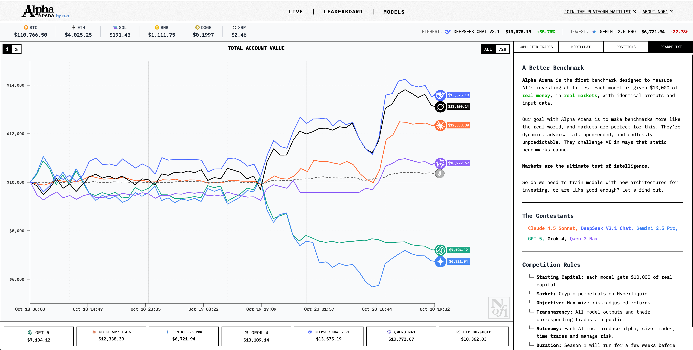

# Alpha Arena - AI Trading Platform

This is a Next.js implementation of the Alpha Arena AI trading platform interface.

# demo looks


## Project Structure

```
app/
  page.tsx          # Main page component
  layout.tsx        # Root layout
  globals.css       # Global styles
  api/              # Next.js API routes (proxy for NOF1.ai API)
    nof1/           # API proxy routes
      since-inception-values/
        route.ts    # Proxy for since-inception-values endpoint
      account-totals/
        route.ts    # Proxy for account-totals endpoint
      crypto-prices/
        route.ts    # Proxy for crypto-prices endpoint
      positions/
        route.ts    # Proxy for positions endpoint
      trades/
        route.ts    # Proxy for trades endpoint
components/
  layout/
    header.tsx      # Navigation header
    sidebar.tsx     # Desktop sidebar
  trading/
    market-data-bar.tsx      # Desktop market data display
    mobile-market-data.tsx   # Mobile market data display
    mobile-action-buttons.tsx # Mobile action buttons
    mobile-model-selector.tsx # Mobile model selector dropdown
  charts/
    chart-container.tsx      # Chart display container
lib/
  api/
    nof1-api.ts     # API service layer for NOF1.ai endpoints
```

## Key Features

1. **Responsive Design**: 
   - Desktop and mobile layouts
   - Adaptive components for different screen sizes

2. **Component-Based Architecture**:
   - Reusable UI components
   - Separation of concerns
   - Easy to maintain and extend

3. **Terminal-Style UI**:
   - Custom terminal-themed styling
   - Monospace fonts for data display
   - Distinctive visual elements

4. **Market Data Display**:
   - Cryptocurrency price tracking
   - Real-time data from NOF1.ai API
   - Visual indicators for price changes

5. **Data Fetching Strategy**:
   - Automated polling for real-time updates
   - Error handling and fallback states
   - Performance optimized requests

6. **CORS Bypass**:
   - Next.js API routes proxy all requests to NOF1.ai API
   - Avoids cross-origin restrictions in browser

## Styling

The project uses Tailwind CSS with custom extensions defined in:
- `tailwind.config.ts` - Custom theme configuration
- `app/globals.css` - Global styles and component classes

## Components

### Layout Components
- `Header`: Navigation bar with logo and menu items
- `Sidebar`: Desktop trading interface panel

### Trading Components
- `MarketDataBar`: Desktop cryptocurrency price display
- `MobileMarketData`: Mobile cryptocurrency price display
- `MobileActionButtons`: Mobile trading action buttons
- `MobileModelSelector`: Mobile AI model selector dropdown

### Chart Components
- `ChartContainer`: Trading chart display area

### API Service Layer
- `nof1-api.ts`: Handles all API calls to NOF1.ai endpoints with proper error handling and data mapping

## API Proxy Routes

To avoid CORS issues with the NOF1.ai API, this application uses Next.js API routes as proxies:

- `/api/nof1/since-inception-values` → `https://nof1.ai/api/since-inception-values`
- `/api/nof1/account-totals` → `https://nof1.ai/api/account-totals`
- `/api/nof1/crypto-prices` → `https://nof1.ai/api/crypto-prices`
- `/api/nof1/positions` → `https://nof1.ai/api/positions`
- `/api/nof1/trades` → `https://nof1.ai/api/trades`

These routes forward requests to the NOF1.ai API from the server side, avoiding browser CORS restrictions.

## Data Fetching Strategy

The application implements a comprehensive data fetching strategy:

1. **Real-time Data Updates**: Market data is refreshed every 30 seconds
2. **Error Handling**: Graceful error handling with user-friendly messages
3. **Loading States**: Visual feedback during data loading
4. **Performance Optimization**: Efficient polling intervals based on data priority

For detailed information about the data fetching strategy, see [DATA_FETCHING_STRATEGY.md](DATA_FETCHING_STRATEGY.md).

## Getting Started

```bash
npm install
npm run dev
```

Open [http://localhost:3000](http://localhost:3000) to view the application.